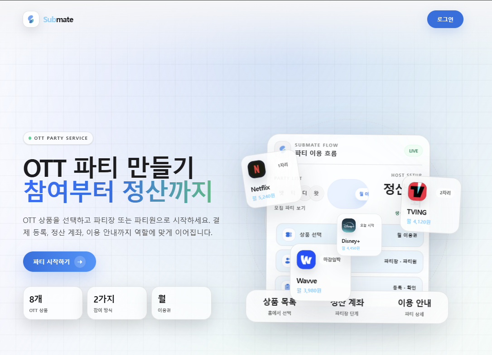
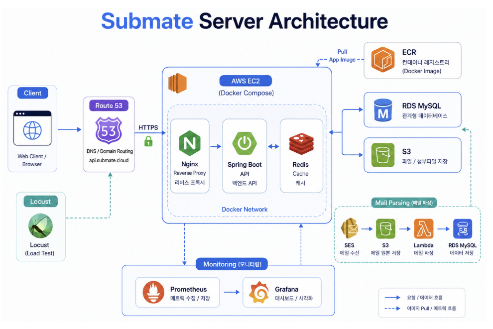
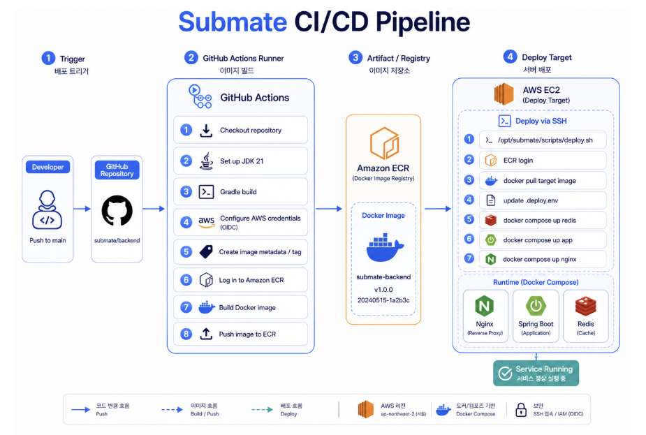
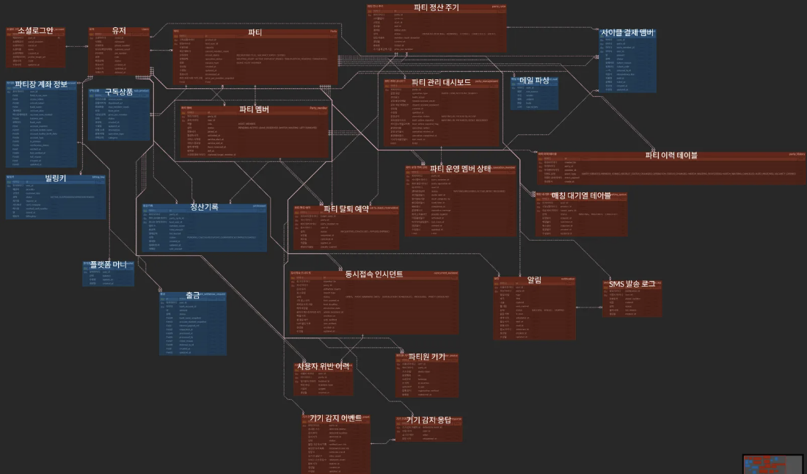

# SubMate Backend

<div align="center">
  
</div>

<br/>

<div align="center">

### Language & Framework


<br/>

### Database & State Store


<br/>

### Infra & DevOps


<br/>

### External API & Monitoring


</div>

---

## 1. 프로젝트 개요

**SubMate**는 OTT 및 구독 서비스의 공동 이용을 위한 파티 매칭, 결제, 정산, 이용 정보 공유 기능을 제공하는 구독 공유 플랫폼입니다.

SubMate 백엔드는 사용자가 구독 상품을 선택해 파티를 만들거나 기존 파티에 참여할 수 있도록 지원하며, 파티 모집 상태, 자동 매칭 대기열, 빌링 결제, 정산 포인트, 출금 요청, 알림, 동시접속 이슈, 관리자 운영 기능을 관리하는 **Spring Boot 기반 API 서버**입니다.

### 주요 목표

* 구독 상품 기반 파티 생성 및 자동 매칭
* Toss Payments Billing 기반 반복 결제 처리
* 파티장 정산 포인트 적립 및 출금 요청 관리
* KFTC 오픈뱅킹 기반 정산 계좌 등록
* 공유 계정 및 초대 링크 등 이용 정보 안전 공유
* 동시접속 이슈 신고 및 위반 기록 관리
* 관리자 운영을 위한 회원, 파티, 상품, 결제 실패, 출금 요청 관리

---

## 2. 프로젝트 정보

| 항목          | 내용                          |
| ----------- |-----------------------------|
| 프로젝트명       | SubMate                     |
| 서비스 유형      | OTT / 구독 서비스 공동 이용 플랫폼      |
| Backend     | Spring Boot API Server      |
| 배포 환경       | AWS EC2, Docker Compose     |
| API 문서      | `/swagger-ui/index.html`    |
| 운영 Profile  | `prod`                      |
| 개발 기간       | `2026.04 ~ 2026.06`         |
| Repository  | `https://github.com/2026-GNU-PBL2/BE`     |
| Backend API | `https://api.submate.cloud` |

---

## 3. 핵심 도메인

| 도메인      | 설명                                            |
| -------- | --------------------------------------------- |
| 회원 / 인증  | OAuth 로그인, JWT 인증, 회원가입, 내 정보 관리, 휴대폰 인증      |
| 구독 상품    | OTT / 구독 상품 조회, 관리자 상품 등록 및 수정, S3 이미지 업로드    |
| 파티       | 파티 생성, 모집, 참여, 결원 참여, 탈퇴, 이용 상태 관리            |
| 자동 매칭    | 즉시 참여 가능한 파티 매칭, 불가능 시 대기열 등록                 |
| 이용 정보 공유 | 공유 계정 / 초대 링크 등록, 파티원 확인, 비밀번호 마스킹 및 조회       |
| 결제       | Toss Payments 빌링키 발급, 반복 결제, 결제 내역, 실패 결제 재시도 |
| 정산       | 파티장 포인트 적립, 정산 내역 조회, 출금 요청, 관리자 승인 / 거절      |
| 계좌       | KFTC 오픈뱅킹 기반 정산 계좌 인증 및 등록                    |
| 동시접속 관리  | 기기 정보 수집, 동시접속 신고, 위반 기록, 경고 처리               |
| 알림       | 매칭, 결제, 정산, 이용 정보 관련 이벤트 알림 및 SMS 발송          |
| 관리자      | 회원, 파티, 상품, 결제 실패, 출금 요청 운영 관리                |

---

## 4. 주요 기능

### 4.1 파티 생성 및 모집

* 사용자는 원하는 구독 상품을 선택해 파티를 생성할 수 있습니다.
* 파티 생성 전 예상 결제 금액을 미리 확인할 수 있습니다.
* 모집 인원이 충족되면 파티 이용 정보 등록 및 결제 흐름으로 전환됩니다.

### 4.2 자동 매칭

* 사용자가 특정 상품에 참여를 신청하면 즉시 참여 가능한 파티를 우선 탐색합니다.
* 참여 가능한 파티가 없는 경우 자동 매칭 대기열에 등록됩니다.
* 이후 결원이 발생하거나 신규 파티가 생성되면 대기열 기반으로 매칭됩니다.

### 4.3 결원 파티 참여

* 파티원 또는 파티장 결원이 발생한 파티를 조회할 수 있습니다.
* 사용자는 결원 파티 상세 정보를 확인하고 직접 참여할 수 있습니다.
* 결원 참여 시 파티 상태와 결제 상태를 함께 고려합니다.

### 4.4 이용 정보 공유

* 파티장은 공유 계정, 비밀번호, 초대 링크 등 이용 정보를 등록할 수 있습니다.
* 파티원은 본인이 속한 파티의 이용 정보를 확인할 수 있습니다.
* 비밀번호는 기본적으로 마스킹 처리되며, 별도 요청 시 조회할 수 있습니다.
* 파티원별 이용 정보 확인 여부를 관리합니다.

### 4.5 Toss Payments 빌링 결제

* 사용자는 Toss Payments Billing을 통해 빌링키를 발급받습니다.
* 파티 참여 및 반복 결제 시 저장된 빌링 정보를 기반으로 결제가 처리됩니다.
* 결제 실패 내역은 관리자 페이지에서 확인하고 재시도할 수 있습니다.

### 4.6 정산 및 출금

* 파티 이용이 확정되면 파티장에게 정산 포인트가 적립됩니다.
* 파티장은 적립된 포인트를 기준으로 출금 요청을 생성할 수 있습니다.
* 관리자는 출금 요청을 승인하거나 거절할 수 있습니다.

### 4.7 오픈뱅킹 계좌 등록

* KFTC 오픈뱅킹 인증을 통해 사용자의 계좌 정보를 조회합니다.
* 사용자는 정산에 사용할 대표 계좌를 등록할 수 있습니다.
* 등록된 정산 계좌는 조회 및 삭제할 수 있습니다.

### 4.8 동시접속 이슈 관리

* 파티원은 동시접속 문제를 신고할 수 있습니다.
* 파티장은 신고된 이슈를 확인하고 조치 완료 처리할 수 있습니다.
* 서버는 동시접속 이슈 이력과 위반 기록을 관리합니다.

### 4.9 알림

* 매칭, 결제, 정산, 이용 정보 등록 등 주요 이벤트 발생 시 알림을 생성합니다.
* 읽지 않은 알림 수 조회, 단건 읽음 처리, 전체 읽음 처리를 지원합니다.
* 필요한 이벤트는 SMS 발송과 연동됩니다.

### 4.10 관리자 운영

* 관리자는 회원, 파티, 상품, 결제 실패, 출금 요청을 관리할 수 있습니다.
* 관리자 대시보드에서 서비스 운영 현황을 확인할 수 있습니다.
* 실패 결제 재시도 및 출금 승인 / 거절 기능을 제공합니다.

---

## 5. 기술 스택

### Backend

| 기술                | 사용 목적                       |
| ----------------- | --------------------------- |
| Java 21           | Backend Application Runtime |
| Spring Boot 3.5.9 | API Server Framework        |
| Spring Web        | REST API 구현                 |
| Spring WebFlux    | 외부 API 연동 및 비동기 HTTP Client |
| Spring Validation | Request DTO 검증              |
| MyBatis           | SQL Mapper                  |
| MySQL             | 운영 Database                 |
| H2                | Local 개발 및 테스트 Database     |
| Redis             | Cache / State Store         |
| JWT               | 인증 토큰 발급 및 검증               |
| OAuth2            | Kakao, Naver, Google 로그인 연동 |
| Springdoc OpenAPI | Swagger API 문서화             |

### External Integration

| 기술                    | 사용 목적            |
| --------------------- | ---------------- |
| Toss Payments Billing | 빌링키 발급 및 반복 결제   |
| KFTC Open Banking     | 정산 계좌 인증 및 계좌 조회 |
| AWS S3                | 상품 이미지 및 파일 저장   |
| Solapi                | SMS 인증 및 알림 발송   |

### Infra / DevOps

| 기술              | 사용 목적                 |
| --------------- | --------------------- |
| Docker          | 애플리케이션 컨테이너화          |
| Docker Compose  | EC2 내 다중 컨테이너 운영      |
| GitHub Actions  | CI/CD 자동화             |
| AWS ECR         | Docker Image Registry |
| AWS EC2         | 운영 서버                 |
| Spring Actuator | 애플리케이션 상태 및 메트릭 제공    |
| Prometheus      | 메트릭 수집                |
| Grafana         | 메트릭 시각화               |
| cAdvisor        | 컨테이너 리소스 모니터링         |

---

## 6. 서버 아키텍처

> 아래 이미지는 SubMate 백엔드 서버의 전체 인프라 및 요청 흐름을 나타냅니다.

<div align="center">
  
</div>

### 아키텍처 구성 요약

* Client는 Nginx Reverse Proxy를 통해 Spring Boot API Server로 요청을 전달합니다.
* Spring Boot Application은 MySQL, Redis, S3, Toss Payments, KFTC Open Banking, Solapi와 연동됩니다.
* 운영 환경에서는 Docker Compose 기반으로 Application, Nginx, Redis, Monitoring Container를 관리합니다.
* Prometheus는 Actuator Metrics와 cAdvisor Metrics를 수집하고, Grafana는 이를 시각화합니다.

---

## 7. CI/CD 파이프라인

> main 브랜치에 push되면 GitHub Actions가 빌드, 이미지 생성, ECR Push, EC2 배포 스크립트 실행을 자동으로 수행합니다.

<div align="center">
  
</div>

### 배포 흐름

```text
1. main 브랜치 push
2. GitHub Actions Workflow 실행
3. JDK 21 환경에서 Gradle Build
4. Docker Image Build
5. AWS ECR Push
6. EC2 SSH 접속
7. 배포 스크립트 실행
8. Docker Compose 기반 컨테이너 재기동
9. 운영 서버는 SPRING_PROFILES_ACTIVE=prod로 실행
```

---

## 8. API 문서

상세 API 명세는 Swagger UI를 통해 확인할 수 있습니다.

```text
/swagger-ui/index.html
```

운영 서버 기준 예시:

```text
https://api.submate.cloud/swagger-ui/index.html
```

---

## 9. API 명세 요약

<details>
<summary>Auth / User API</summary>

| 구분   | Method | Endpoint                            | 설명                 |
| ---- | ------ | ----------------------------------- | ------------------ |
| Auth | POST   | `/api/v1/auth/login`                | OAuth 로그인 및 JWT 발급 |
| User | POST   | `/api/v1/user`                      | 회원가입               |
| User | GET    | `/api/v1/user`                      | 내 정보 조회            |
| User | PATCH  | `/api/v1/user`                      | 내 정보 수정            |
| User | DELETE | `/api/v1/user`                      | 회원 탈퇴              |
| User | GET    | `/api/v1/user/check/email`          | 이메일 중복 확인          |
| User | GET    | `/api/v1/user/check/nickname`       | 닉네임 중복 확인          |
| User | POST   | `/api/v1/user/phone/verify/request` | 휴대폰 인증 요청          |
| User | POST   | `/api/v1/user/phone/verify/confirm` | 휴대폰 인증 확인          |

</details>

<details>
<summary>Product API</summary>

| 구분      | Method | Endpoint                | 설명          |
| ------- | ------ | ----------------------- | ----------- |
| Product | GET    | `/api/v1/products`      | 구독 상품 목록 조회 |
| Product | GET    | `/api/v1/products/{id}` | 구독 상품 상세 조회 |

</details>

<details>
<summary>Party / Party Join / Vacancy API</summary>

| 구분         | Method | Endpoint                                    | 설명                 |
| ---------- | ------ | ------------------------------------------- | ------------------ |
| Party      | POST   | `/api/v1/parties/create-preview`            | 파티 생성 전 금액 미리보기    |
| Party      | POST   | `/api/v1/parties`                           | 파티 생성              |
| Party Join | POST   | `/api/v1/party-join/preview`                | 파티 참여 전 결제 정보 미리보기 |
| Party Join | POST   | `/api/v1/party-join/apply`                  | 자동 매칭 신청           |
| Party Join | GET    | `/api/v1/party-join/me`                     | 내 매칭 신청 조회         |
| Party Join | POST   | `/api/v1/party-join/{joinRequestId}/cancel` | 매칭 신청 취소           |
| Vacancy    | GET    | `/api/v1/party-vacancy/members`             | 파티원 결원 파티 목록 조회    |
| Vacancy    | GET    | `/api/v1/party-vacancy/hosts`               | 파티장 결원 파티 목록 조회    |
| Vacancy    | GET    | `/api/v1/party-vacancy/members/{partyId}`   | 파티원 결원 파티 상세 조회    |
| Vacancy    | GET    | `/api/v1/party-vacancy/hosts/{partyId}`     | 파티장 결원 파티 상세 조회    |
| Vacancy    | POST   | `/api/v1/party-vacancy/{partyId}/join`      | 결원 파티 직접 참여        |

</details>

<details>
<summary>Provision API</summary>

| 구분        | Method | Endpoint                                             | 설명                |
| --------- | ------ | ---------------------------------------------------- | ----------------- |
| Provision | GET    | `/api/v1/parties/{partyId}/provision/recruit-status` | 모집 완료 여부 조회       |
| Provision | POST   | `/api/v1/parties/{partyId}/provision`                | 파티 이용 정보 등록       |
| Provision | GET    | `/api/v1/parties/{partyId}/provision`                | 파티 이용 현황 조회       |
| Provision | GET    | `/api/v1/parties/{partyId}/provision/members`        | 이용 정보 확인 멤버 목록 조회 |
| Provision | POST   | `/api/v1/parties/{partyId}/provision/confirm`        | 파티원 이용 확인 완료      |
| Provision | POST   | `/api/v1/parties/{partyId}/provision/reset`          | 이용 정보 재설정         |
| Provision | GET    | `/api/v1/parties/{partyId}/provision/me`             | 내 이용 정보 조회        |
| Provision | POST   | `/api/v1/parties/{partyId}/provision/me/password`    | 공유 계정 비밀번호 조회     |

</details>

<details>
<summary>Payment API</summary>

| 구분      | Method | Endpoint                                | 설명                  |
| ------- | ------ | --------------------------------------- | ------------------- |
| Payment | POST   | `/api/v1/payments/billing/authorize`    | 빌링키 발급              |
| Payment | GET    | `/api/v1/payments/billing/customer-key` | Toss customerKey 조회 |
| Payment | GET    | `/api/v1/payments/billing/me`           | 내 빌링 정보 조회          |
| Payment | POST   | `/api/v1/payments/billing/change`       | 빌링키 변경              |
| Payment | GET    | `/api/v1/payments/me/history`           | 내 결제 내역 조회          |

</details>

<details>
<summary>Settlement / Bank API</summary>

| 구분         | Method | Endpoint                                | 설명          |
| ---------- | ------ | --------------------------------------- | ----------- |
| Settlement | POST   | `/api/v1/settlements/withdraw-requests` | 출금 요청       |
| Settlement | GET    | `/api/v1/settlements/withdraw-requests` | 내 출금 요청 조회  |
| Settlement | GET    | `/api/v1/settlements/points`            | 내 정산 포인트 조회 |
| Settlement | GET    | `/api/v1/settlements/history`           | 내 정산 내역 조회  |
| Bank       | GET    | `/api/v1/bank/authorize`                | 오픈뱅킹 인증 콜백  |
| Bank       | POST   | `/api/v1/bank/settlement`               | 정산 계좌 등록    |
| Bank       | DELETE | `/api/v1/bank/settlement`               | 정산 계좌 삭제    |
| Bank       | GET    | `/api/v1/bank/accounts`                 | 연결 계좌 목록 조회 |
| Bank       | GET    | `/api/v1/bank/accounts/primary`         | 대표 정산 계좌 조회 |

</details>

<details>
<summary>Notification / Concurrent Issue API</summary>

| 구분           | Method | Endpoint                                      | 설명            |
| ------------ | ------ | --------------------------------------------- | ------------- |
| Notification | GET    | `/api/v1/notifications`                       | 알림 목록 조회      |
| Notification | GET    | `/api/v1/notifications/unread-count`          | 읽지 않은 알림 수 조회 |
| Notification | PATCH  | `/api/v1/notifications/{notificationId}/read` | 알림 읽음 처리      |
| Notification | PATCH  | `/api/v1/notifications/read-all`              | 전체 알림 읽음 처리   |
| Concurrent   | POST   | `/api/v1/concurrent-issues/{partyId}`         | 동시접속 이슈 신고    |
| Concurrent   | POST   | `/api/v1/concurrent-issues/{partyId}/resolve` | 파티장 조치 완료     |
| Concurrent   | GET    | `/api/v1/concurrent-issues/{partyId}/history` | 이슈 이력 조회      |

</details>

<details>
<summary>Admin API</summary>

| 구분            | Method | Endpoint                                                    | 설명           |
| ------------- | ------ | ----------------------------------------------------------- | ------------ |
| Admin         | GET    | `/api/v1/admin/check`                                       | 관리자 권한 확인    |
| Admin         | GET    | `/api/v1/admin/dashboard`                                   | 관리자 대시보드 조회  |
| Admin         | GET    | `/api/v1/admin/users`                                       | 회원 목록 조회     |
| Admin         | GET    | `/api/v1/admin/users/{userId}`                              | 회원 상세 조회     |
| Admin         | GET    | `/api/v1/admin/parties`                                     | 파티 목록 조회     |
| Admin         | GET    | `/api/v1/admin/parties/{partyId}`                           | 파티 상세 조회     |
| Admin         | POST   | `/api/v1/admin/payments/cycles/{partyCycleId}/retry`        | 실패 결제 재시도    |
| Admin         | GET    | `/api/v1/admin/settlements/withdraw-requests`               | 출금 요청 목록 조회  |
| Admin         | POST   | `/api/v1/admin/settlements/withdraw-requests/{id}/complete` | 출금 요청 승인     |
| Admin         | POST   | `/api/v1/admin/settlements/withdraw-requests/{id}/reject`   | 출금 요청 거절     |
| Admin Product | GET    | `/api/v1/admin/products`                                    | 관리자 상품 목록 조회 |
| Admin Product | POST   | `/api/v1/admin/products`                                    | 관리자 상품 등록    |
| Admin Product | PUT    | `/api/v1/admin/products/{id}`                               | 관리자 상품 수정    |

</details>

---

## 10. 디렉토리 구조

```text
src
 └── main
     ├── java
     │   └── com
     │       └── submate
     │           ├── auth
     │           ├── user
     │           ├── product
     │           ├── party
     │           ├── partyjoin
     │           ├── provision
     │           ├── payment
     │           ├── settlement
     │           ├── bank
     │           ├── notification
     │           ├── concurrentissue
     │           ├── admin
     │           ├── global
     │           │   ├── config
     │           │   ├── error
     │           │   ├── security
     │           │   └── response
     │           └── SubmateApplication.java
     │
     └── resources
         ├── mapper
         ├── application.yml
         ├── application-local.yml
         └── application-prod.yml
```

---

## 11. ERD

<div align="center">
  
</div>

---

## 12. 운영 환경

### Runtime

| 항목                  | 내용                                   |
| ------------------- | ------------------------------------ |
| Runtime             | Java 21                              |
| Framework           | Spring Boot 3.5.9                    |
| Profile             | `prod`                               |
| Database            | MySQL                                |
| Cache / State Store | Redis                                |
| Container           | Docker, Docker Compose               |
| Deploy              | AWS ECR Image Build 후 EC2 배포 스크립트 실행 |

### 배포 서버 구성

```text
EC2
 ├── Nginx
 ├── Spring Boot Application Container
 ├── Redis Container
 ├── Prometheus Container
 ├── Grafana Container
 └── cAdvisor Container
```

---

## 13. Trouble Shooting / 개선 경험

### 13.1 결제 처리 성능 및 정합성 개선

기존 결제 구조는 **결제 요청 이후 외부 PG 호출과 결제 결과 저장이 하나의 동기 흐름에 강하게 묶여 있는 구조**였습니다.  
이로 인해 PG 응답을 기다리는 동안 **HTTP 요청 스레드와 DB 트랜잭션이 길게 점유**될 수 있었고, 고부하 상황에서 **p95 / p99 응답 시간이 증가**하는 문제가 발생했습니다.

이를 개선하기 위해 결제 실행 구조를 **`@Async paymentExecutor + 3-Phase Transaction`** 구조로 리팩토링했습니다.  
결제 요청 트랜잭션이 커밋된 이후 **`PaymentExecutionRequestedEvent`** 를 발행하고, 실제 PG 결제 호출은 결제 전용 executor에서 비동기로 처리하도록 분리했습니다.

| 구분 | 기존 구조 | 개선 구조 |
| --- | --- | --- |
| 실행 방식 | 동기 처리 | `@Async` 기반 비동기 처리 |
| 실행 스레드 | HTTP 요청 스레드 | `paymentExecutor` 워커 스레드 |
| 트랜잭션 범위 | PG 호출까지 포함한 긴 TX | DB 변경 구간만 짧은 TX |
| PG 호출 위치 | Transaction 내부 | Transaction 외부 |
| DB 커넥션 점유 | PG 대기 중에도 점유 가능 | PG 대기 중 미점유 |
| 정합성 처리 | 단일 흐름 기반 | CAS + 멱등 처리 + 실패 복구 |

#### 기존 구조

```text
retry()
 → 커밋 후 이벤트 발행
 → 같은 HTTP 요청 스레드에서 결제 실행
 → 단일 Transaction 안에서 PG 호출 및 결과 저장
```

#### 개선 구조

```text
retry()
 → DB Transaction Commit
 → PaymentExecutionRequestedEvent 발행
 → @Async("paymentExecutor")
 → 결제 전용 executor queue에 작업 적재
 → AutoPaymentService.execute() 비동기 실행
```

#### 3-Phase 처리 구조

| Phase | Transaction | 역할 |
| --- | --- | --- |
| Phase 1 | 짧은 TX | 결제 사이클 선점, 멤버 결제 row 생성, 멤버별 `PROCESSING` 선점 |
| Phase 2 | 없음 | 트랜잭션 밖에서 외부 PG API 호출 |
| Phase 3 | 짧은 TX | 결제 결과 저장, 사이클 상태 전환, 미처리 멤버 복구 |

이 구조를 통해 **외부 PG 호출 구간에서는 DB 커넥션과 락을 점유하지 않도록 개선**했습니다.

---

### 13.2 CAS 기반 중복 결제 방지

비동기 구조로 변경하면서도 결제 정합성을 유지하기 위해 상태 전이에 **CAS 방식의 조건부 update**를 적용했습니다.

| 적용 대상 | 상태 전이 | 목적 |
| --- | --- | --- |
| 결제 사이클 | `PAYMENT_PENDING -> PROCESSING` | 동일 cycle 중복 실행 방지 |
| 멤버별 결제 | `PAYMENT_PENDING -> PROCESSING` | 동일 멤버 중복 결제 방지 |
| 실패 처리 | `PROCESSING -> FAILED` | 이미 변경된 상태 덮어쓰기 방지 |

결제 사이클은 `PAYMENT_PENDING -> PROCESSING` 상태 전이 시 현재 상태 조건을 함께 확인합니다.  
update 결과가 1건이면 해당 실행자가 결제 사이클을 선점한 것이고, 0건이면 이미 다른 실행자가 처리 중인 것으로 판단하여 중복 실행을 방지합니다.

```sql
UPDATE party_cycle
SET status = 'PROCESSING',
    updated_at = NOW()
WHERE id = #{partyCycleId}
  AND status = 'PAYMENT_PENDING'
```

멤버별 결제도 동일하게 `PAYMENT_PENDING -> PROCESSING` 상태 전이에 CAS를 적용하여 같은 멤버에 대한 중복 결제를 방지했습니다.

```sql
UPDATE party_cycle_member_payment
SET status = 'PROCESSING',
    updated_at = NOW()
WHERE party_cycle_id = #{partyCycleId}
  AND party_member_id = #{partyMemberId}
  AND status = 'PAYMENT_PENDING'
```

결제 row 생성은 **`INSERT IGNORE` 기반 batch insert**로 처리하여 이미 생성된 멤버 결제 row가 있더라도 중복 생성되지 않도록 멱등성을 확보했습니다.

---

### 13.3 Executor Queue 기반 결제 실행 분리

결제 실행은 Kafka나 RabbitMQ 같은 외부 메시지 큐가 아니라, Spring `@Async`와 `ThreadPoolTaskExecutor`의 **인메모리 작업 큐**를 사용했습니다.

```java
@Async("paymentExecutor")
@EventListener
public void handle(PaymentExecutionRequestedEvent event) {
    autoPaymentService.execute(event.partyId(), event.partyCycleId());
}
```

`paymentExecutor`는 결제 실행 전용 스레드풀로 분리했습니다.

| 설정 | 값 |
| --- | --- |
| `corePoolSize` | 40 |
| `maxPoolSize` | 80 |
| `queueCapacity` | 200 |
| `RejectedExecutionHandler` | `CallerRunsPolicy` |

이를 통해 HTTP 요청 스레드는 PG 호출 완료를 기다리지 않고 빠르게 반환됩니다.  
또한 queue가 포화될 경우 `CallerRunsPolicy`를 통해 호출 스레드가 직접 실행하도록 하여 작업이 무한히 적재되는 상황을 방지했습니다.

---

### 13.4 Fail-fast 상황의 미처리 멤버 복구

기존 구조에서는 멤버 결제 row를 `PROCESSING`으로 선점한 뒤 첫 번째 PG 호출이 실패하면 fail-fast로 후속 PG 호출이 중단되었습니다.  
이 경우 실제 PG 호출이 수행되지 않은 멤버도 `PROCESSING` 상태로 남아 재시도 대상에서 제외될 수 있는 문제가 있었습니다.

```text
멤버 전체 PROCESSING 선점
 → 첫 PG 실패
 → fail-fast로 후속 PG 호출 중단
 → PG 미호출 멤버도 PROCESSING 상태로 잔존
 → retry 시 CAS 실패
 → 재청구 누락 가능
```

이를 해결하기 위해 Phase 3 실패 처리에서 PG 호출 결과가 없는 멤버를 `PAYMENT_PENDING`으로 복구했습니다.

| 대상 | 처리 |
| --- | --- |
| PG 호출 성공 멤버 | `PAID` 처리 |
| PG 호출 실패 멤버 | `FAILED` 처리 |
| PG 호출 전 fail-fast로 중단된 멤버 | `PROCESSING -> PAYMENT_PENDING` 복구 |

이를 통해 실패 이후에도 미처리 멤버가 다음 retry에서 다시 결제 대상이 될 수 있도록 보장했습니다.

---

### 13.5 리팩토링 결과

| 지표 | 리팩토링 전 | 리팩토링 후 | 변화 |
| --- | --- | --- | --- |
| 총 요청 수 | 119,595건 | 126,362건 | 증가 |
| RPS | 199.22 | 258.38 | 약 30% 증가 |
| 실패율 | 0% | 0% | 유지 |
| Median | 270ms | 91ms | 약 66% 감소 |
| p95 | 1800ms | 520ms | 약 71% 감소 |
| p99 | 3400ms | 1300ms | 약 62% 감소 |
| 평균 응답 | 543.53ms | 162.87ms | 약 70% 감소 |
| Max | 15542ms | 2828ms | 약 82% 감소 |

리팩토링 결과, 결제/정산 API의 처리량은 증가했고 Median, p95, p99 응답 시간이 모두 감소했습니다.  
특히 p95 응답 시간이 **1800ms에서 520ms로 감소**하여 결제/정산 도메인의 tail latency 병목이 완화되었습니다.

> 기존 동기 이벤트 + 단일 긴 트랜잭션 구조를 **`@Async paymentExecutor + 3-Phase TX`** 구조로 변경했습니다.  
> 외부 PG 호출 구간을 트랜잭션 밖으로 분리하여 DB 커넥션 점유를 줄였고, **CAS 상태 전이와 멱등 insert, fail-fast 복구 로직**을 통해 비동기 구조에서도 결제 정합성을 유지했습니다.

---

## 14. 팀원 소개

| 이름  | 역할                   | 담당 영역           | GitHub                                |
|-----|----------------------|-----------------|---------------------------------------|
| 김용환 | Backend / Infra / PM | 자동결제, 정산, 메일    | [@lifeisgood7](https://github.com/lifeisgood7) |
| 김하진 | Backend              | 파티, 파티운영, 낯선기기 신고 | [@lilyloper](https://github.com/lilyloper)     |
| 박성우 | Frontend / Design    | UI/UX           | [@arkeongoo](https://github.com/arkeongoo) |

---

## 15. 참고 문서

* API 문서: `/swagger-ui/index.html`
* 서버 아키텍처: `./docs/images/server-architecture.png`
* CI/CD 파이프라인: `./docs/images/cicd-pipeline.png`
* ERD: `./docs/images/erd.png`
* 모니터링 대시보드: `./docs/images/monitoring.png`

---

## 16. 보안 주의 사항

본 프로젝트는 결제, 계좌, 인증, 정산 정보를 다루므로 다음 정보를 Repository에 포함하지 않습니다.

* DB 접속 정보
* JWT Secret
* Toss Payments Secret Key
* KFTC Open Banking Client Secret
* AWS Access Key / Secret Key
* Solapi API Key / Secret
* 운영 서버 접속 정보
* 사용자 개인정보 및 실제 결제 데이터

환경 변수 예시는 `.env.example`로만 관리하고, 실제 운영 Secret은 GitHub Actions Secrets 또는 서버 내부 환경 변수로 관리합니다.

## 참고 문서

| 문서                                                | 설명 |
|---------------------------------------------------| --- |
| [Submate 명세서](./docs/pdf/submate-api-spec.pdf)    | SubMate 상세 명세 |
| [프로젝트 발표 자료](./docs/pdf/submate-presentation.pdf) | 프로젝트 구조, 주요 기능, 시연 흐름 정리 |